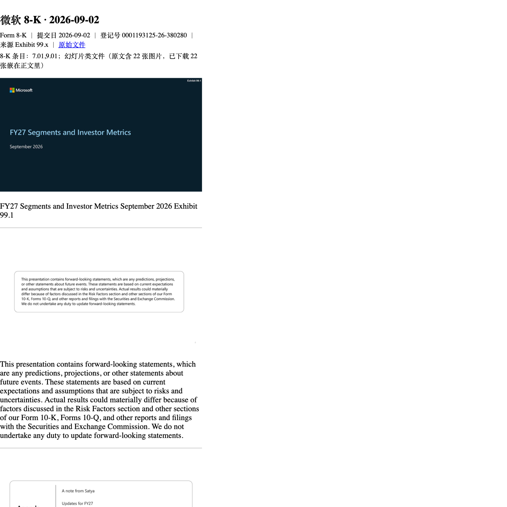
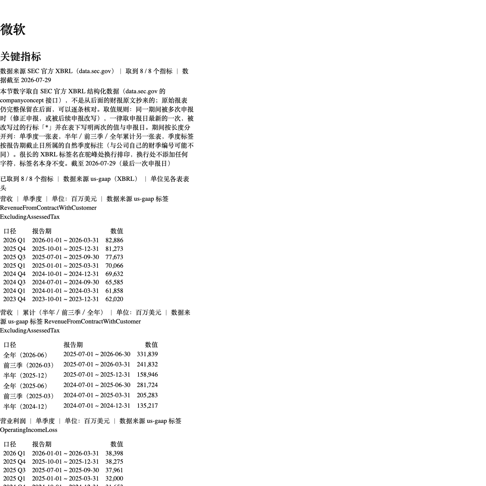
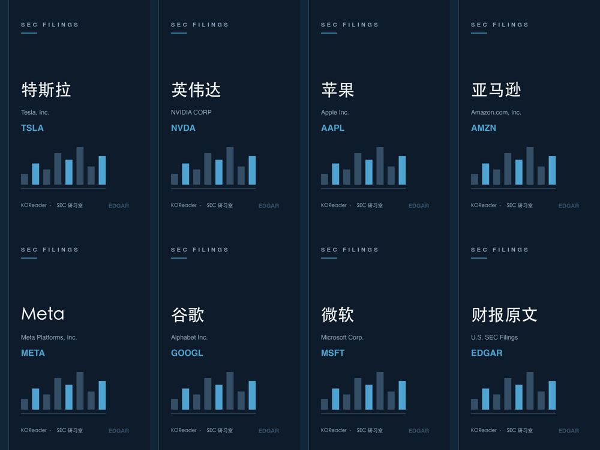

# KOReader SEC Filings（SEC 研习室）

把美国上市公司提交给 **SEC EDGAR** 的申报文件，直接变成本地可读的 EPUB，放进 Kindle 书库。

为 6 寸墨水屏做的，和「能不能下载到文件」这件事无关 —— SEC 的官方订阅源里**只有元数据、没有正文**，
所以 KOReader 自带的新闻下载器做不出能读的东西。这个插件解决的是「**能读**」这一段。



| | |
|---|---|
|  |  |

---

## 它做什么

- **关注列表**：勾几家美国公司，一键把最近的申报做成书；只抓新的，不重复下载
- **任意表格类型**：按股票代码 / CIK / 公司名搜索，能看的不只是财报 ——
  10-K、10-Q、8-K、13F-HR、S-1、DEF 14A、Form 4、SC 13D …（实测某公司三年窗口内有 23 种类型）
- **6 寸屏能读的宽表**：SEC 财务报表动辄 20 多列，直接把数字压成「一堆文本」；
  这里按列投影拆成窄表，**数字一格不丢**
- **图片会一起抓进来**：幻灯片类 exhibit（分部业绩、投资者演示）的可见内容全在图片里，
  原文那层文字被 SEC 刻意写成「1pt、纯白、行高 0」当作无障碍替代文本
- **书首「关键指标」章**：取 SEC 官方 XBRL 结构化数据，最多 8 个指标按季度 / 累计分表对照
- **每本书带封面**，睡眠屏和书架都能用

---

## 安装

需要一台**已越狱并装好 KOReader** 的 Kindle。

1. 把 `secfilings.koplugin/` 整个文件夹拷到 Kindle 的 `koreader/plugins/` 下
   （用 USB 连线，或 KOReader 的 SSH/SFTP 都行）
2. 重启 KOReader（**整个进程**，不是关掉书 —— 插件只在启动时加载）
3. 打开 **工具 → SEC 研习室 → 设置 → SEC 联系邮箱**，填一个你自己的邮箱

> **第 3 步不能跳。** SEC 要求每个请求的 `User-Agent` 里带一个能联系到你的邮箱，
> 否则一律返回 403。代码里**故意不硬编码任何邮箱** —— 硬编码一个私人邮箱，
> 开源之后它就会被爬虫和垃圾邮件盯上。

---

## 怎么用

```
工具 🔧 → SEC 研习室
├── 下载全部关注的公司（7 家 × 最近 5 份）
├── 下载某一家
├── 搜索公司…                    ← 代码 / CIK / 公司名，任意表格类型
├── 搜索结果：<公司>（N 份）      ← 搜过之后才出现
│   ├── 只看年报季报（10-K / 10-Q / 8-K）
│   ├── 按类型筛选（选项来自真实分布）
│   ├── 关注「<公司>」
│   └── 逐份文件（点一份 = 关注这一类并下载）
├── 我的关注列表（7 家）
├── 打开下载目录
└── 设置
```

书放在书库的 `SEC 财报/` 分类下，文件名是 `<公司名> SEC 财报.epub`。

---

## 几个实测出来的坑（写在这里，免得别人重踩）

1. **不加筛选的类型清单里 51% 是 Form 4**（内部人交易）。
   实测苹果三年窗口 264 份里 Form 4 占 135 份、144 占 41 份，而 10-K 只有 3 份。
   所以「按类型筛选」是必需功能，不是装饰。
2. **`limit` 会让类型分布变成假的**。取列表时如果带上条数上限，
   「边扫边筛」会提前收工，分布只统计到被截断的那一段 —— 实测给 `limit=12` 时
   分布里只剩下 Form 4 和 144。时间窗（`since`）才是正确的边界。
3. **内联样式会压过读者的字体设置**。一份 10-Q 里有 72,106 处内联 `style=`，
   其中 `font-family` 46,838 处 —— 用户在设备上换字体、调字号**完全没有反应**。
   所以清理阶段要把表现层属性摘掉，只留结构和语义。
4. **`addPath` 成功时也返回 `false`**（KOReader 的 `ffi/archiver`）。
   收尾是 `return r == ARCHIVE_OK`，而正常结束的 `r` 是 `ARCHIVE_EOF`。
   按返回值判成败，会把每一本带图的书都判成失败。
5. **`addFileFromMemory` 写进 zip 的权限是 `0o1204`**：上游写的是
   `archive_entry_set_perm(entry, 0644)`，而 Lua 5.1 没有八进制字面量，
   这个 `0644` 是十进制 644。后果是用 `unzip` 解包后文本文件属主读不了。
   （不影响 Kindle 阅读 —— 那里是进程内读 zip。）
6. **`pcall(lfs.dir, path)` 会丢掉目录对象**。`lfs.dir` 返回 (迭代器, 目录对象)，
   通用 `for` 会把第二个值当状态参数传回去；只接第一个的话真机会报
   `directory metatable expected, got nil`。**本地用替身 lfs 测不出来。**
7. **EDGAR 的 accession 前缀是上报代理的编号，不是 CIK**。
   （苹果 368 份文件里有 42 个不同前缀。）所以跨文件做字符串比较是错的，
   增量判定必须比 `filing_date`。
8. **历史分片 `submissions-00N.json` 的 JSON 结构与主文件不同**：主文件有
   `filings.recent` 包装，分片顶层直接就是列字典。按同一种结构解析分片会**静默**
   少掉一大半历史文件。
9. **XBRL 标签会停更**：英伟达的主营收标签停在 2022-01-30，谷歌的停在 2025-03-31。
   取指标的规则因此改成「挑期间最晚的那个候选标签」，而不是「第一个能用的」。
   亚马逊则从未申报过 `us-gaap:Liabilities` —— 这种情况如实标「未取到」，不做替代。
10. **任意类型的主文档有三种形态**。Form 4 的 `primary_document` 是
    `xslF345X06/form4.xml`，拿回来其实是 SEC 渲染好的 HTML（能读）；
    而 S-8 那类返回体带着 EDGAR 的 SGML 外壳
    （`<DOCUMENT> <TYPE>S-8 … <TEXT> <html>`），必须先剥壳。

---

## 怎么确认「数字没丢」

这个插件唯一的严重风险是**静默丢数据**：书看起来是对的，只是少了一整块内容。
所以每种改动都配一个能失败的检查，而不是靠看。

- **逐格无损**：库里有 **10,194 行** Lua 模块、**2,817 行**技术文档、
  **834 行**验证脚本。宽表拆分的自检会把输出反解析回网格，逐格比对位置与 `colspan`
- **新旧对照**：`tools/verify/oldnew_diff.lua` 把改动前后的清理结果放在同一份真实原文上跑，
  判据是「剥掉标签后的文本逐字节相同」**且**「数字 token 的多重集相同」。
  6 份真实财报（特斯拉 / 微软 / 亚马逊 / 英伟达 / 苹果）全部通过
- **独立第二实现**：`tools/verify/epub_check.py` 用另一个语言、另一套 zip 库重写验收：
  `mimetype` 必须是第一条且 STORED、OPF 声明的每个 item 必须在 zip 里、
  封面 meta 必须指得到、TOC 目标必须存在、**内联表现属性残留数必须为 0**、
  class 必须在样式表白名单内。它自己也做过**变异测试**（注入 6 类故障，逐一被抓）
- **真机跑**：`tools/verify/plugin_shell_test.lua` 在 Kindle 上用桩替换 UI 模块，
  执行**真实的 `main.lua`** 走完整下载。它存在的理由是：上一轮交付失败的根本原因，
  就是外壳从来没有被真正执行过

---

## 不承诺的事

- **不做定时自动下载。** Kindle 睡着的时候没有代码在跑，醒着的时候也不保证有网络。
  能承诺的是「打开 KOReader 时检查一次」，这需要你自己点「下载全部关注的公司」
- **不做估值、不做横向对比、不做全文检索。** 这是阅读器，不是研究终端
- **不生成 PDF。** 设备上没有 PDF 渲染链，正文到 EPUB 这一段是唯一的可行路线
- **图片没有总量上限。** 一份带 200 张大图的 10-K 会把书推到几十 MB。
  目前靠「按份数上限」和「每本书独立工作目录、用完即清」控制

---

## 许可

**AGPL-3.0**（见 [LICENSE](LICENSE)）。

---

## English summary

A KOReader plugin that turns **SEC EDGAR** filings into readable EPUBs for e-ink readers.

SEC's own feeds are metadata-only, so KOReader's built-in news downloader can't produce anything
legible. This plugin does the conversion: fetch → clean → flatten 20-column financial tables
(column projection, lossless) → embed slide images → prepend an XBRL key-metrics chapter → package
as EPUB with a cover.

- Any filing type, not just reports: 10-K, 10-Q, 8-K, 13F-HR, S-1, DEF 14A, Form 4, SC 13D …
- Watchlist with incremental downloads (baseline by `filing_date` — EDGAR accession prefixes
  belong to the filing agent, not the CIK)
- A literal contact email in the User-Agent is **required by SEC**; nothing is hardcoded,
  you set it in the plugin's settings

Install: copy `secfilings.koplugin/` into `koreader/plugins/`, restart KOReader, then set your
email under **Tools → SEC 研习室 → Settings**. Licensed AGPL-3.0.

Technical notes, including the non-obvious findings, are in
[docs/TECHNICAL-FINDINGS.md](docs/TECHNICAL-FINDINGS.md).
